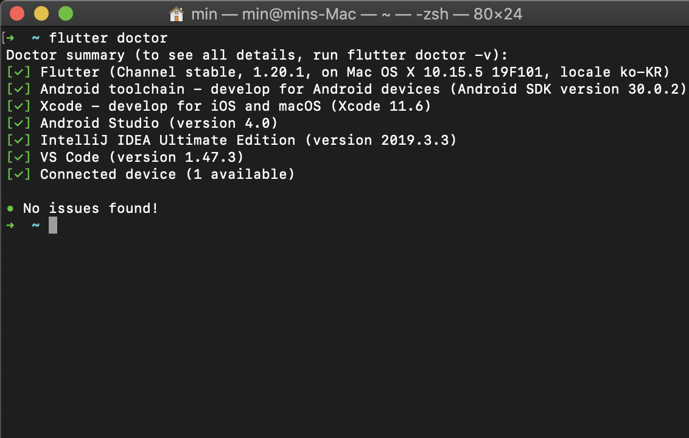

# StudyFlutter

## MAC에 Flutter 설치하기

MAC OS환경에 Flutter 개발환경을 세팅한다.

### 준비물

Flutter 데모 어플리케이션을 구동시키기 위해 아래 준비가 필요하다.

* Flutter (Channel stable, 1.20.1, on Mac OS X 10.15.5 19F101, locale ko-KR)
* Android toolchain - develop for Android devices (Android SDK version 30.0.2)
* Xcode - develop for iOS and macOS (Xcode 11.6)
* Android Studio (version 4.0)
* IntelliJ IDEA Ultimate Edition (version 2019.3.3)
* VS Code (version 1.47.2)
* Connected device

### SDK 다운로드

~~~
https://flutter.dev/docs/development/tools/sdk/releases
~~~

위 URL에서 버전에 맞는 release를 다운로드 한다.
댜운로드 한 뒤 적절한 위치에 압출을 푼다.

~~~
$ cd ~/development
$ unzip ~/Downloads/flutter_macos_1.20.2-stable.zip
~~~

### PATH 설정

터미널에서 flutter 명령어를 실행히키기 위해 시스템 PATH에 flutter/bin을 등록한다.
~~~
$ export PATH="$PATH:`pwd`/flutter/bin"
~~~

문서를 작성하는 환경은 zsh 쉘을 사용하기 때문에 사용자 계정의 .zsh 파일의 export항목에 flutter가 있는 "/Users/min/development/flutter/bin" PATH를 등록했다.

### Flutter doctor 실행

~~~
$ flutter doctor 
~~~
doctor 명령을 실행하여 flutter가 동작하기 위한 의존성들을 확인할 수 있다.

문서를 쓰기 전 의존성들을 모두 설치했기 때문에 모두 통과된 상태다.
실제 의존성 이슈가 발생하면 친절히 설명해 주기 때문에 알아서 적절히 필요 항목들을 설치하면 된다(그냥 설치만 하면 돼서 딱히 이슈가 없었다).

##### 설치항목
- Flutter 
- Android toolchain: Android studio에서 flutter 플러그인을 설치하면 된다.
- Xcode: 앱스토어에서 설치한다.
- IntelliJ IDEA Ultimate Edition: 의존성에 인텔리제이를 요구하는데 2019.3.3월 이후에 나온 버전이 필요하다. Android studio를 설치했으면 필요 없을것 같은데, 이미 설치되 있어서 그냥 진행했다.
- VS Code: VS Code에서 extension을 받으면 된다.
- Connected device: Android, IOS 둘 중 하나 이상의 에뮬레이터(Simulator) 혹은 USB로 연결된 device가 필요하다. 여기선 Xcode에 딸려오는 Simulator를 이용해 진행했다.

### Demo start

Simulator를 구동시킨 후 아래 순서로 데모 앱을 실행해 본다.
~~~
$ flutter create my_app
$ cd my_app
$ flutter run
~~~

{:width="50" height="150"}

잘 실행되는것 같다.

### Next

여기까지 Flutter 환경 설정이 끝났고, 이어서 데모앱을 가지고 튜토리얼을 진행해 보겠다.

참고자료: https://flutter.dev/docs/get-started/install/macos#update-your-path
 
 
