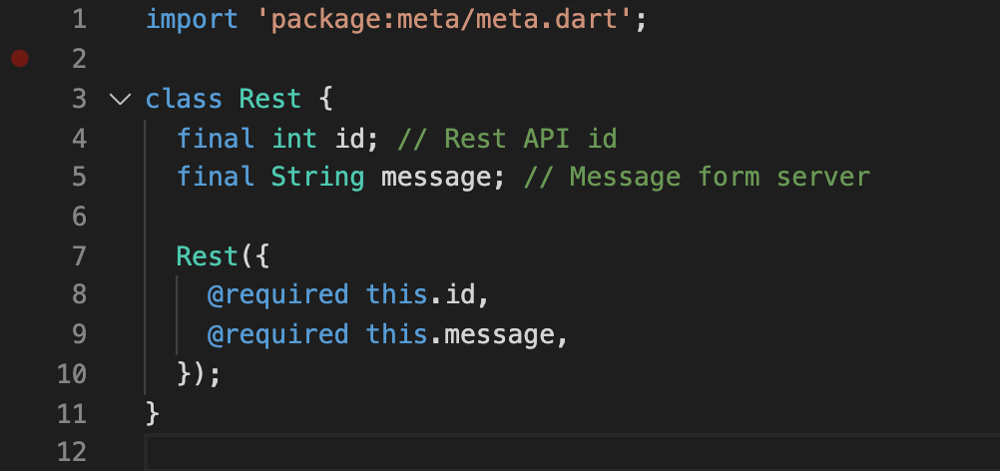

# StudyFlutter

## BLoC pattern이란

최근 유행하는 많은 front-end framework에서는 Text field, List view등 UI에서 보여주는 변화 가능한 데이터를 상태(State)로 정의하여 관리한다. 

그런데 앱의 규모가 커지면 커질수록 state의 관리가 어려워진다. ui를 개발하다보면 컴포넌트들 간에 state를 전달하거나 공유해야 하는 일이 빈번한데, 규모가 커지면 커질수록 state를 관리하는 비용이 증가할 수 밖에 없다. front-end 진영에서는 이러한 state 관리 비용을 줄이기 위해 다양한 라이브러리들을 개발했는데, 대표적으로 redux, mobix등이 있다. 

BLoC pattern은 Bussiness Logic Component의 줄임말로, Google에서 Flutter의 상태 관리를 제어하기 위해 디자인 되었다.

위 그림이 BLoC pattern의 컨셉이다. 

1. widget들은 event를 sinks를 통해 BLoC에 전달한다.
2. BLoC은 bussiness logic을 통해 전달받은 event를 처리한다.
3. BLoC은 처리된 결과를 stream을 통해 widget들에서 publish한다.

BLoC pattern은 ui를 business logic과 분리하는것을 의미한다. 위 과정을 거쳐 Widget들은 데이터를 관리해야하는 책임에서 벗어나 오로지 어플리케이션의 화면에만 집중할 수 있게 된다.

## BLoC pattern 구현

BLoC pattern은 Observer pattern으로 구현되어 있다. Presentational component(Widget)들은 BLoC의 state를 subscribe한다. stream을 통해 state의 변화를 감지하면, 변경된 데이터를 기반으로 ui를 업데이트 하는 것이다.

위 그림은 BLoC pattern의 데이터 흐름이다. Event가 발생하면 BLoC에 dispatch한다. BLoC에서는 해당 event의 business logic을 실행하고 그 결과를 state에 업데이트 한다. 업데이트된 state가 weidget에 전달되면 해당하는 component가 다시 랜더링 된다.

## BLoC pattern 예제

이제 BLoC pattern을 적용하여 backend와 rest API통신을 하는 간단한 어플리케이션을 만들어 보자.

* 구현 동작
1. API 통신을 하기 전 초기화 동작
2. API 통신을 통해 message 데이터를 갱신하고 ui에 표현 

Pub에서 제공하는 BLoC 라이브러리와 Event class를 정의하기 위해 pubspec.yaml의 dependencies에 flutter_bloc, equatable 패키지를 추가한다.  
주소 - https://pub.dev/packages/flutter_bloc

### 디렉토리 구조

BLoC를 구현하기 위해 bloc, model, repository, ui 디렉토리를 만들었다. 
1. bloc - BLoC 클래스와 BLoC에 전달되는 event, 데이터인 state 클래스
2. model - Rest API를 통해 받아온 데이터 모델
3. repositry - API 통신을 담당하는 클래스
4. ui - 실제 화면에 그려지는 view

### model, Rest

Backend서버와 통신하기 위한 데이터 모델을 정의한다.
간단한 메시지를 주고받기 위해 메시지 id와 String으로 된 문자열을 정의했다.

### repository, Rest API, API Server

BLoC pattern에서는 repository는 business logic 처리, backend와의 통신을 담당한다. ui가 구독하는 실제 데이터의 업데이트, 조작등은 모두 이 클래스에서 이루어진다.

그림의 RestAPI 클래스는 httpClient 클래스를 통해 back-end 서버와 통신한다. getMessage 메소드를 호출하면 "http://localhost:3001/message" 주소에 post 메소드를 요청한다. async, await를 사용하여 Future를 return한다. 요청이 완료되는 시점에 모델인 Rest 클래스를 반환할 수 있도록 하기 위함이다.
 * 12 라인에서 response 코드를 확인하여 200번이 아닌 경우 Exception을 발생시킨다.
 * 15 라인에서는 response의 body를 json으로 변환하는 jsonDecode함수를 사용했다.

예제 어플의 Rest API통신을 테스트 하기 위해 nodejs로 간이 서버를 만들었다. "/message" url로 post 요청이 오면 위에서 정의한 Rest 모델을 response한다.

### bloc, RestBloc, RestEvent, RestState

#### RestState

RestState 클래스는 BLoC에서 관리하는 상태 클래스이다.
데이터 모델인 Rest를 맴버로 관리하며, 상태를 초기화, 업데이트 하는 메소드를 제공한다. ui가 구독하는 state로, 이 state들이 ui에 그대로 전달되어 view가 구성된다. 

#### RestEvent

RestEvent 클래스는 BLoC에 전달되는 event 클래스이다. 슈퍼 클래스인 RestEvent를 추상화 하여 RestEvent들을 정의하였다. event클래스 자체에는 아무 기능이 없지만, ui에서 event가 발생했을때 이를 BLoC에 전달하기 위해 사용한다. Equatable 클래스를 상속받아 자식 클래스들끼리 비교할 수 있도록 했다.

#### RestBloc

Rest API통신을 BLoC pattern을 사용하여 구현하기 위한 state, event, 데이터 모델, repository가 완성되었다.
이제 각 구성 요소들과 ui를 연결하는 BLoC을 구현한다.

RestBloc은 flutter_bloc에서 제공하는 bloc 클래스를 상속받는다. bloc 클래스는 ui에서 전달된 event와 businiess logic을 연결한다. 
* 13 라인의 mapEventToState 메소드를 통해 event를 전달받는다. event의 종류에 따라(init event, update event) 적절한 business logic을 호출한다.

* async*, yield 키워드는 Stream에 데이터 변경을 알리는 동작이다. yield로 state를 전달하면 구독하고 있는 ui들이 변경 이벤트를 감지하여 컴포넌트를 다시 랜더링 하게 된다.

##### Stream, async* + yield

### ui, RestUI

 BLoC pattern의 목적에 맞게 ui에서는 데이터와 관련된 state들을 가지지 않는다. 대신 bloc 정의된 state를 구독하고 사용자의 조작에 따라 연결된 bloc Event를 전달하기만 한다.

#### Home.dart

RestUI 클래스를 구현하기 전 RestBloc을 생성하고 하위 컴포넌트들이 RestBloc에 접근할 수 있도록 하는 작업이 필요하다.

BLoC pattern에서 컴포넌트들은 Provider를 통해 bloc에 접근한다. BlocProvider는 bloc을 생성, 관리하며 컴포넌트들이 구독할 수 있는 Stream을 제공한다. 
앱에서 RestUI에 접근하기 전 Home Widget을 만들어 하위 Widget들을 MultiBlocProvider로 감싼다. MultiBlocProvider의 BlocProvider로 RestBloc을 생성한다. 이제 MultiBlocProvider 하위의 모든 컴포넌트들은 RestBloc에 접근 가능하며, Stream을 통해 state를 구독할 수 있다.

#### RestUI

* 16라인 - bloc에 접근할 수 있도록 _restBloc을 BlocProvider로 초기화 한다.
* 17라인 - bloc.add(Event event) 메소드를 통해 bloc에 RestInit event를 전달한다.
* 22라인 - 기존 Widget의 build 메소드와 다르게 컴포넌트들을 BlocListener로 감싸 RestBloc의 RestState를 구독한다.
* 30라인 - State를 구독하는 컴포넌트는 BlocBuilder로 랜더링 한다. 

### 구현 결과

#### 초기 상태

#### 동작 완료

